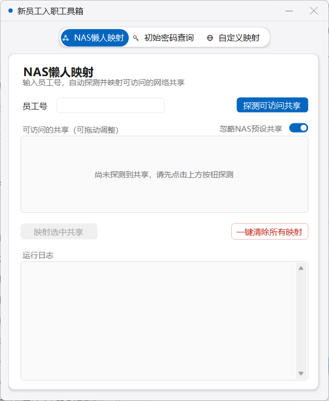
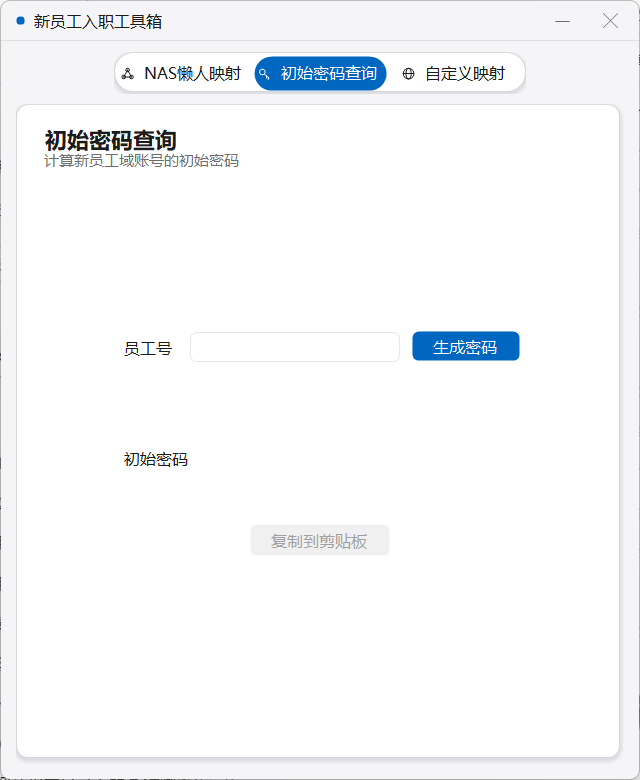
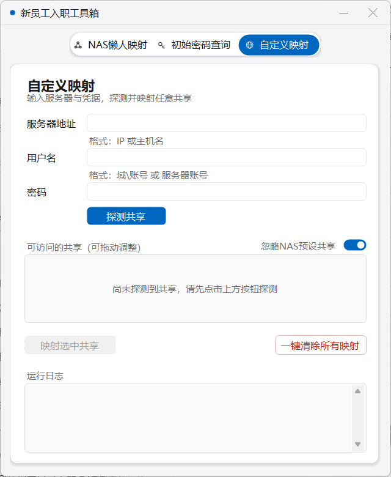

# 新员工入职工具箱 (New Hire Toolbox)

为 corp1.local / corp2.local 多域环境设计的新员工入职支持工具，供 IT 与 Helpdesk 使用。
单文件 exe，仅依赖 Windows 自带的 .NET Framework 4.x，双击即用，无需安装、无需配置。

两个域中相同员工号的账号使用相同的初始密码——工具箱通过内置 Seed 与统一的
HMAC-SHA256 算法保证各处计算结果一致且可复现。

## 使用须知（重要）

本仓库为**脱敏公开版本**，克隆后请按以下步骤适配你自己的环境：

1. **替换 Seed**：`src/PasswordGenerator.cs` 中的 `REPLACE-WITH-YOUR-OWN-SECRET-SEED`
   是占位符，请换成你自己的高强度随机字符串并妥善保密——Seed 决定全部初始密码，
   一经确定不要再改（改动会导致与已建账号的密码对不上）。
2. **替换域名与 IP**：源码与文档中的 `corp1.local` / `corp2.local`、
   `CORP1` / `corp2`、`192.168.100.10` / `192.168.200.22` 均为虚假占位值，
   请改为你的真实域与 NAS 地址（主要在 `src/NewHireToolbox.cs` 的 `NasTargets` 数组）。
3. **自行编译**：仓库不含编译产物（exe 会内嵌 Seed，故不入库），
   完成上述替换后双击 `build.bat` 即可生成 `dist/NewHireToolbox.exe`。

## AI构建提示词

```
请先阅读 https://github.com/CoolingRabbit/new-hire-tools 仓库，在和我确认好具体需求后，参考它为我创建一个适合我环境的新员工入职工具箱；过程中如有改进建议，请整理成文档，便于我提交 Issues。
```

## 功能特性

### 1. NAS懒人映射
输入员工号，自动完成全流程：

- 自动计算初始密码（界面不显示）
- 探测员工可访问的 NAS（CORP1 `192.168.100.10` / corp2 `192.168.200.22`）
- 凭据自动保存到 Windows 凭据管理器（只保存探测成功的 NAS）
- 列出全部可访问共享，支持勾选、**上下拖动调整顺序**
- 按列表顺序从 `Z:` 依次分配盘符，持久化映射（自动跳过已占用盘符）
- 附 **一键清除所有映射**（断开当前用户全部网络驱动器，操作前有确认框）

### 2. 初始密码查询
输入员工号生成 8 位初始密码（含大写/小写/数字/特殊符号四类），一键复制到剪贴板。

### 3. 自定义映射
输入服务器地址（IP 或主机名）+ 用户名 + 密码，自动探测该服务器的全部共享，
勾选并拖动排序后映射。同样附一键清除所有映射。

所有耗时操作均在后台线程执行，界面不卡死；每个功能页带实时运行日志。

## 界面预览

| NAS懒人映射 | 初始密码查询 | 自定义映射 |
|---|---|---|
|  |  |  |

界面采用 Win11 原生风格：自绘沉浸式标题栏与圆角窗口、
设计 token 化的配色/字阶/间距（8px 网格）、柔和投影、分段式导航胶囊滑动动画、
按钮渐变过渡、输入框聚焦高亮等微交互。

## 项目结构

```
new-hire-tools/
├── README.md               # 项目文档
├── build.bat               # 一键编译脚本（输出到 dist/）
├── dist/
│   └── NewHireToolbox.exe  # 编译产物（主交付物）
├── src/
│   ├── NewHireToolbox.cs   # 工具箱源码（界面 + 网络封装 + 三个功能页）
│   ├── PasswordGenerator.cs# 密码算法（员工号 -> 初始密码）
│   └── AssemblyInfo.cs     # 程序集信息（产品名称 / 版本 / 版权）
├── assets/screenshots/     # 界面截图
├── tests/
│   ├── smoke-shot.ps1      # 启动 exe 并自动点击 Tab、截图（UI 回归）
│   └── share-enum-test.ps1 # NetShareEnum 共享枚举连通性测试（需在内网运行）
└── docs/
    ├── dev-log.md          # 开发日志
    └── development-prompt.md # 项目开发提示词（可复用的需求+工程规范）
```

## 密码算法说明

- 拼接字符串：`员工号_2026`
- `HMAC-SHA256(内置Seed, 拼接串)` → Base64 → 取前 8 位
- 复杂度修复：缺失类别按固定位置确定性替换（替换字符取自摘要字节，
  保证任意实现结果一致、可复现）

## 安全说明

- Seed 内置于源码，不出现在界面、控制台或任何日志/文件中
- 自动计算的密码仅用于临时探测与凭据保存，使用后主动清除内存变量
- 只保存探测成功的 NAS 凭据，保存前先清理旧凭据避免冲突
- 映射类操作基于 `net use` / `cmdkey`，无需管理员权限

## 开发日志

见 [docs/dev-log.md](docs/dev-log.md)。
